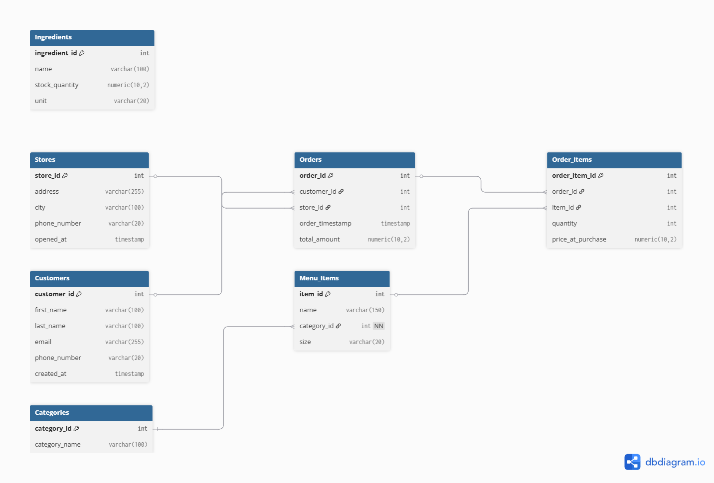
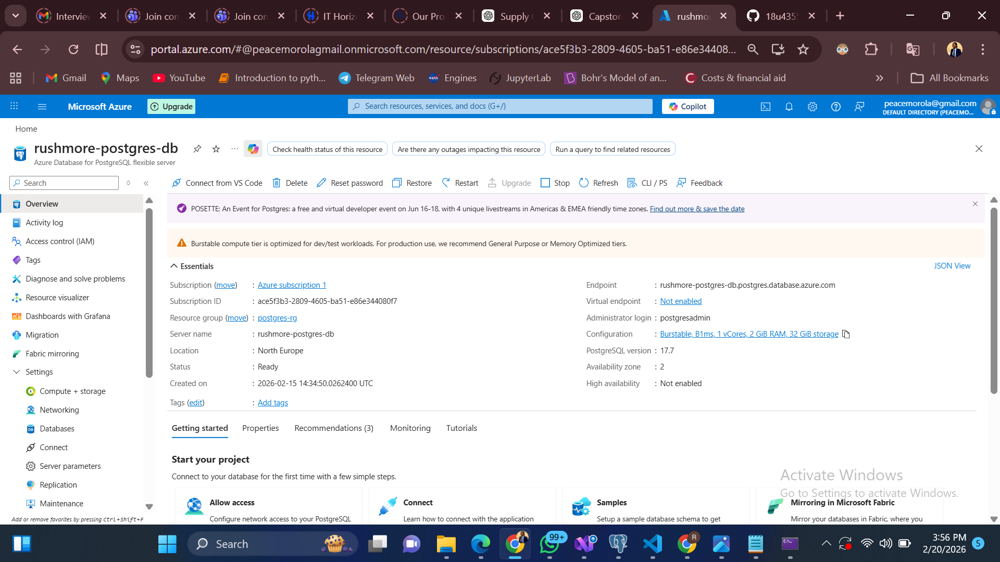
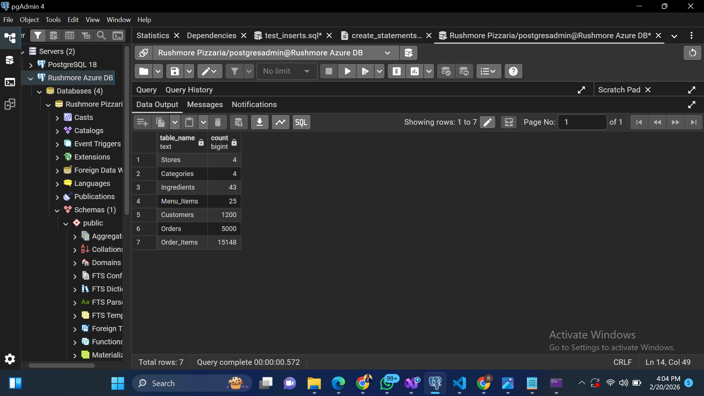
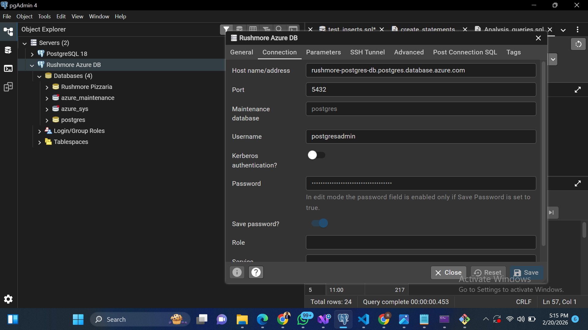

# 🍕 RushMore Pizzeria  
## Enterprise Database System (Capstone Project)

---

## 📌 Project Overview

This project implements a **cloud-based, production-ready PostgreSQL database** for **RushMore Pizzeria**, replacing a fragile JSON-based ordering system with a scalable **Relational Database Management System (RDBMS)**.

As the assigned **Data Engineer & Database Administrator (DBA)**, the objectives were to:

- Design a **normalized relational schema (3NF)**
- Deploy PostgreSQL in the cloud (**Azure Flexible Server**)
- Populate the database with **10,000+ rows of realistic masked data**
- Demonstrate analytical capabilities using SQL queries

The final system serves as a **single source of truth** for stores, customers, menu items, and transactions.

---

# 🏗 System Architecture

Local Machine
   │
   │ (Python + psycopg2 + Faker)
   ▼
Azure PostgreSQL Flexible Server
   │
   ▼
pgAdmin (Database Management & Querying)

---

## 🧩 Components

| Component | Technology Used |
|------------|-----------------|
| **Cloud Provider** | Microsoft Azure |
| **Database Engine** | PostgreSQL 17 |
| **Database Tool** | pgAdmin 4 |
| **Programming Language** | Python 3 |

### 📦 Libraries Used

- `psycopg2-binary`
- `Faker`
- `python-dotenv`

---

---

# 🧠 Part 1 – Database Design

## Entity Relationship Diagram (ERD)

  

The database schema was designed following **Third Normal Form (3NF)** principles to:

- Eliminate redundancy  
- Maintain referential integrity  
- Support scalable analytics  

---

## Tables Implemented

- **Stores**
- **Customers**
- **Ingredients**
- **Categories**
- **Menu_Items**
- **Orders**
- **Order_Items**

---

# ☁ Part 2 – Cloud Deployment (Azure)

### Step 1 – Provision PostgreSQL
- Created **Azure Database for PostgreSQL – Flexible Server**
- Selected **Burstable B1ms**
- Configured firewall rules
- Enabled public access

*(Insert Azure Deployment Screenshot Here)*

### Step 2 – Create Database
Created the **Rushmore Pizzaria** database in Azure.

### Step 3 – Run Schema Script
Executed `create_statements.sql` via pgAdmin to create all tables in the cloud.

---

# 🐍 Part 3 – Data Population with Faker

A Python script (`data_generator.py`) was developed to generate realistic masked data.

### Key Features
- Uses **Faker** for synthetic PII  
- Reads credentials securely from `.env`  
- Respects foreign key constraints  
- Generates **10,000+ records**

---

## Target Data Volume

| Table | Records Generated |
|--------|------------------|
| Stores | 4 |
| Menu_Items | 25 |
| Ingredients | 45 |
| Customers | 1,000+ |
| Orders | 5,000+ |
| Order_Items | 15,000+ |

---

# 📊 Part 4 – Analytics (Proving It Works)

The database supports business insights such as:

- Total revenue per store  
- Top 10 customers by spending  
- Most popular menu item  
- Average order value  
- Busiest hour of the day  

All queries are included in `Analysis_queries.sql`.

---

# 📸 Required Screenshots

### Azure PostgreSQL Instance  

  

 

### Table Row Counts  

  

### pgAdmin Connected to Cloud  

   

---

# 🔐 Security Considerations

- Credentials stored in **`.env`**
- **`.env` excluded via `.gitignore`**
- SSL-encrypted database connection
- Firewall-restricted Azure access
- No real customer data used (masked with Faker)

---

# 🚀 Challenges & Solutions

| **Challenge** | **Solution** |
|---------------|--------------|
| Foreign key constraint errors | Inserted data in correct relational order |
| Phone number length errors | Standardized Faker phone format |
| Slow cloud inserts | Used transaction commit optimization |
| Preserving price history | Stored `price_per_purchase` in `Order_Items` |

---

# 🎯 Learning Outcomes

Through this project, I gained practical experience in:

- Designing **normalized relational databases (3NF)**
- Deploying PostgreSQL in the cloud
- Secure credential management
- Large-scale data population using Faker
- Writing analytical SQL queries
- Managing foreign key relationships and referential integrity

---

# 📂 Repository Structure

CAPSTONE/
│
├── create_statements.sql
├── Analysis_queries.sql
├── ERD.png
├── Azure_deployment.png
├── README.md
│
└── Python_population/
├── data_generator.py
├── connect.py
└── .env (ignored)

---

# ✅ Conclusion

This project successfully migrated RushMore Pizzeria from a static JSON system to a **scalable, cloud-hosted relational database**.

The new system now supports:

- Multi-store operations  
- Secure data storage  
- Large-scale transaction handling  
- Business analytics readiness  

The database is **production-ready** and capable of supporting future BI integrations such as:

- Power BI  
- Tableau  
- Looker Studio  

---
